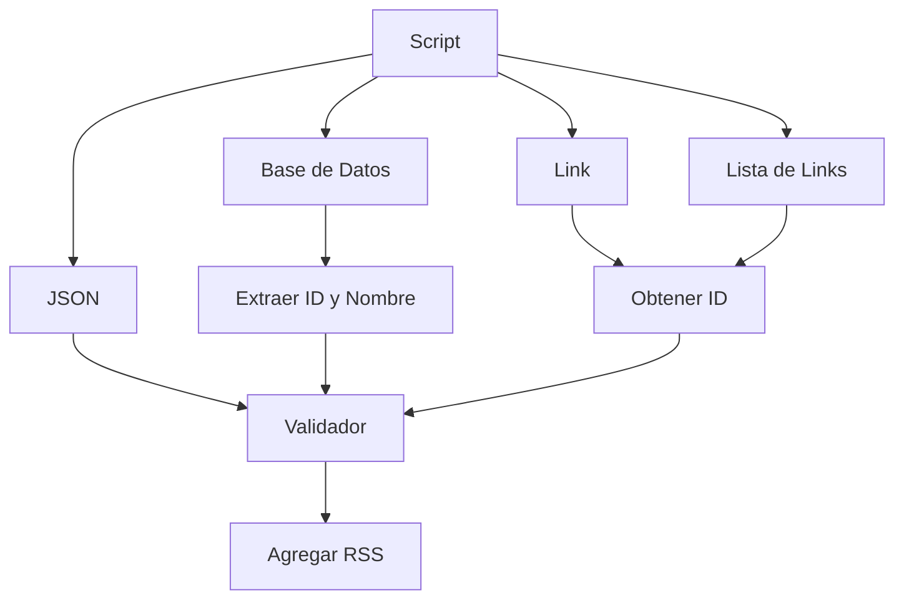

## Agregador de canales de YouTube a Newsboat

**¿Que es?**  
Un script sencillo, escrito en lenguaje **Bash**, que busca el **id** y **nombre** de canales  
de youtube para agregarlos al feed de [newsboat](https://github.com/newsboat/newsboat)  *`~/.config/newsboat/urls`*

Permite importar desde una base de datos de [NewPipe](https://github.com/TeamNewPipe/NewPipe/) (json, db, db.zip)

-----

### Añadir canal(es) al feed RSS
#### Uso
```bash
./newsboat-yt-aggregator.sh
```
```bash
╔═════════════════════════════════════════════════╗
║ Añadir canal(es) de YouTube al feed de Newsboat ║
╚═════════════════════════════════════════════════╝

	Opciones:

	1) Importar desde un link
	2) Importar desde una lista de links
	3) Importar desde base de datos de NewPipe
	4) Importar desde archivo JSON de NewPipe
	0) Salir

	¿Que necesitas?
--> :
```
#### Formatos admitidos

- [x] Link  
- [x] Lista  
- [x] DB  
- [x] DB.zip  
- [x] JSON  

#### Requerimientos
  - **wget**
    - Consultas a youtube.com
  - sqlite3
    - Importa [newpipe](https://github.com/newsboat/newsboat).db, *opcional*
  - unzip
    - Extrae [newpipe](https://github.com/newsboat/newsboat)-db.zip, *opcional*
  - **grep**
  - **sed**

----

### Script

